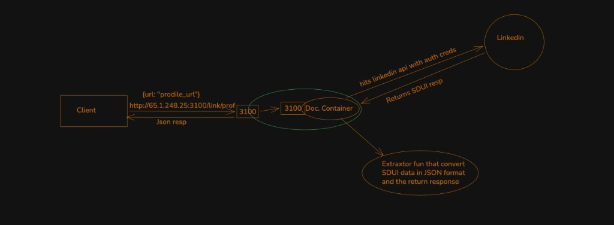
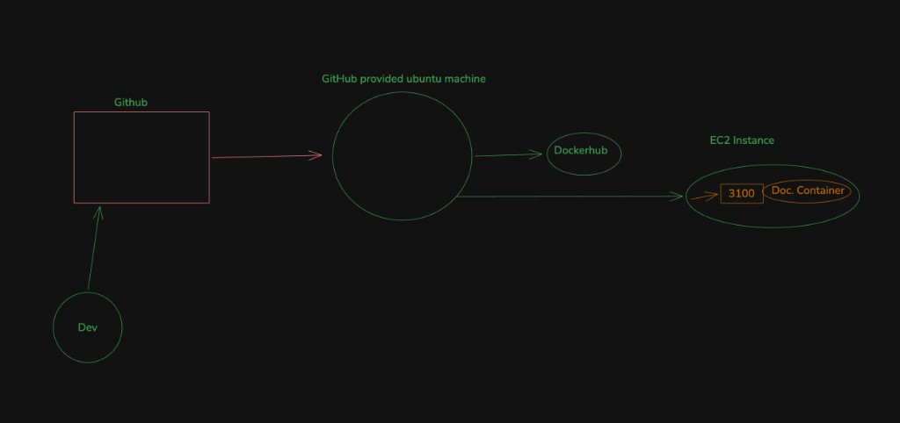

# LinkedIn Profile API

This project is a Small backend service that takes a LinkedIn profile URL and returns the profile data as JSON — things like name, headline, experience, education, images, and so on.

**Live endpoint:** http://scraper.princechaudhary.xyz

---

## How it works

I didn't Use Puppeteer or any Headless browser, and I didn't Use LinkedIn's official API either.

What I did instead was open Chrome DevTools, visit a few LinkedIn profiles, and watch what network calls the site actually makes. Turns out LinkedIn loads profile pages through internal SDUI endpoints — basically POST requests to URLs like: 

```
POST https://www.linkedin.com/flagship-web/in/{username}/
POST https://www.linkedin.com/flagship-web/in/{username}/details/experience/
POST https://www.linkedin.com/flagship-web/in/{username}/details/education/
```

The server replays those same requests using session cookies from a logged-in LinkedIn account. LinkedIn sends back an RSC stream (React Server Components format) — not normal JSON or HTML. There's a custom parser in `src/extractors/` that pulls the useful fields out of that stream and shapes them into clean JSON.

The flow is pretty straightforward:



Client sends a profile URL to `http://scraper.princechaudhary.xyz/api/v1/linkedin/profile`. That hits the Docker container on EC2 (port 3100). The container calls LinkedIn with auth cookies, LinkedIn sends back an SDUI / RSC stream, the extractor turns that into JSON, and the JSON goes back to the client.

---

## Local setup Guide

You'll need a LinkedIn account to grab cookies from. For running the project itself, you can use **Bun** (recommended) or **Node.js + npm**.

### Option A — Bun (recommended)

Install Bun if you don't have it:

```bash
curl -fsSL https://bun.sh/install | bash
```

Then:

```bash
git clone <repo-url>
cd server
bun install
cp .env.example .env
```

Fill in your LinkedIn cookies in `.env`:

```env
HOST=0.0.0.0
PORT=3100
NODE_ENV=development


# Public API CORS
CORS_ORIGIN=*

LINKEDIN_LI_AT=
LINKEDIN_JSESSIONID=
LINKEDIN_CSRF_TOKEN=
LINKEDIN_BSCOOKIE=
LINKEDIN_USER_AGENT=

```

Start dev server:

```bash
bun dev
```

Build and run for production:

```bash
bun run build
bun run start
```

### Option B — Node.js + npm

Works fine for development. You'll need Node.js 18+ installed.

```bash
git clone <repo-url>
cd server
npm install
cp .env.example .env
```

Same `.env` setup as above. Then:

```bash
npm run dev
```


## Running with Docker

The Docker image uses Bun for install and build, then runs the bundled app with Node.

```bash
docker build -t linkedin-scraper-api .
docker run -p 3100:3100 --env-file .env linkedin-scraper-api
```

Or pass the env vars directly if you prefer:

```bash
docker run --rm -p 3100:3100 \
  -e LINKEDIN_LI_AT="..." \
  -e LINKEDIN_JSESSIONID="ajax:..." \
  -e LINKEDIN_CSRF_TOKEN="ajax:..." \
  -e LINKEDIN_BSCOOKIE="..." \
  linkedin-scraper-api
```

---

## Using the live API

The service is deployed on an AWS EC2 instance. No domain at the moment — just the IP.

**Health check**

```bash
curl http://scraper.princechaudhary.xyz
```

**Fetch a profile**

```bash
curl -X POST http://scraper.princechaudhary.xyz/api/v1/linkedin/profile \
  -H "Content-Type: application/json" \
  -d '{"url": "https://www.linkedin.com/in/vinod-prajapati-87604b203/"}'
```

In Postman: set method to POST, URL to `http://65.1.248.25:3100/api/v1/linkedin/profile`, add header `Content-Type: application/json`, and put this in the body:

```json
{
  "url": "https://www.linkedin.com/in/vinod-prajapati-87604b203/"
}
```

The response looks something like this (fields vary depending on the profile):

```json
{
  "name": "Vinod Prajapati",
  "headline": "Software Engineer at ...",
  "location": "India",
  "about": "...",
  "connections": "500+ connections",
  "profileImage": "https://media.licdn.com/...",
  "coverImage": "https://media.licdn.com/...",
  "profileUrl": "www.linkedin.com/in/vinod-prajapati-87604b203",
  "experience": [
    {
      "title": "Software Engineer",
      "company": "Some Company",
      "startDate": "Jan 2022",
      "endDate": "Present"
    }
  ],
  "educations": [
    {
      "school": "Some University",
      "degree": "B.Tech"
    }
  ]
}
```

---

## API endpoints

**`GET /`** — health check. Returns status and a timestamp.

**`POST /api/v1/linkedin/profile`** — the main one. Send a JSON body with a `url` field:

```json
{
  "url": "https://www.linkedin.com/in/username/"
}
```

---

## Getting LinkedIn cookies

The backend needs an active LinkedIn session to make requests. Here's how I grab the cookies:

1. Log into LinkedIn in Chrome
2. Open DevTools → Network tab
3. Go to any profile page
4. Click on a request to `www.linkedin.com`
5. In Request Headers, copy values from `cookie` and `csrf-token`

The ones you need:
- `li_at` → `LINKEDIN_LI_AT`
- `JSESSIONID` → `LINKEDIN_JSESSIONID`
- `csrf-token` → `LINKEDIN_CSRF_TOKEN` (usually the same value as JSESSIONID, without quotes)
- `bscookie` → `LINKEDIN_BSCOOKIE`

These expire after a while — could be a few days, could be a few weeks. When the API starts returning 502s or empty data, it's almost always time to refresh them.

**Locally:** update `.env` and restart the server.

**On the live server:** update the GitHub secrets (`LINKEDIN_LI_AT`, `LINKEDIN_JSESSIONID`, `LINKEDIN_CSRF_TOKEN`, `LINKEDIN_BSCOOKIE`) and push to main to trigger a redeploy.

Never commit `.env` to the repo.

---

## Deployment

Pushes to `main` trigger a GitHub Actions workflow (`.github/workflows/cd_server.yml`).



What the workflow actually does:

1. Builds a Docker image and pushes it to Docker Hub
2. SSHs into the EC2 box at `65.1.248.25`
3. Stops the old container and starts a new one with the latest image

GitHub secrets needed:
- `DOCKER_USERNAME` / `DOCKER_PASSWORD`
- `SSH_PRIVATE_KEY` (the EC2 `.pem` key)
- `LINKEDIN_LI_AT`, `LINKEDIN_JSESSIONID`, `LINKEDIN_CSRF_TOKEN`, `LINKEDIN_BSCOOKIE`

---

## Things that don't work perfectly yet

Worth being upfront about these:

- **Cookies expire.** There's no auto-refresh — you have to manually update them when they die.
- **HTTP only on live.** No HTTPS right now because the domain expired. Renewing the domain and throwing Nginx + Let's Encrypt in front would fix this.
- **Bare IP.** Not great for production, but it works for now.
- **Incomplete data on some profiles.** LinkedIn lazy-loads certain sections, so experience or education might come back empty for some people even though it shows fine in the browser.
- **No skills / certifications / languages yet.** Experience-level skills show up sometimes, but there's no dedicated parsing for the skills section.
- **Undocumented endpoints.** LinkedIn could change their internal API tomorrow and break everything. That's the tradeoff with reverse engineering.
- **Rate limiting.** Hammering it with too many requests might get the session flagged.

---

## Project structure

```
src/
├── index.ts                 # entry point
├── app.ts                   # express setup
├── routes/                  # route definitions
├── controllers/             # handles HTTP in/out
├── services/                # business logic
├── repositories/            # calls LinkedIn endpoints
├── extractors/              # parses the RSC stream
├── utils/                   # URL parsing, errors
└── types/                   # TypeScript types
```

Stack: Bun, Express, TypeScript, Docker, GitHub Actions, AWS EC2.
